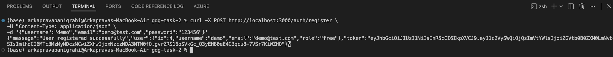
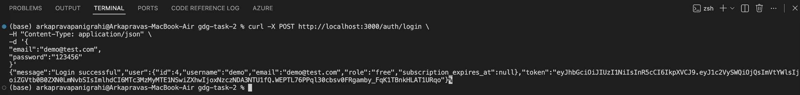
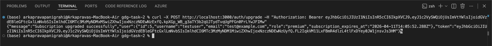
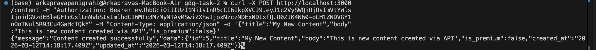
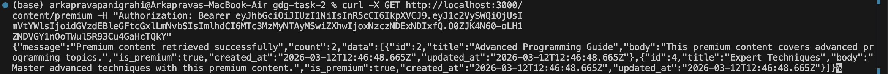
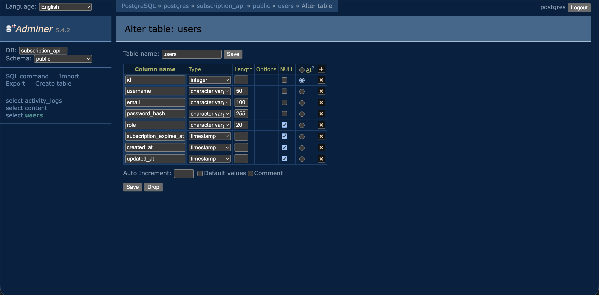
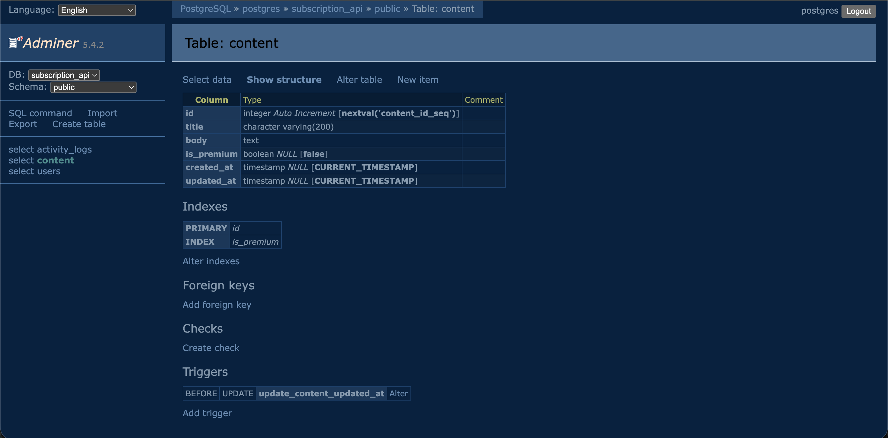
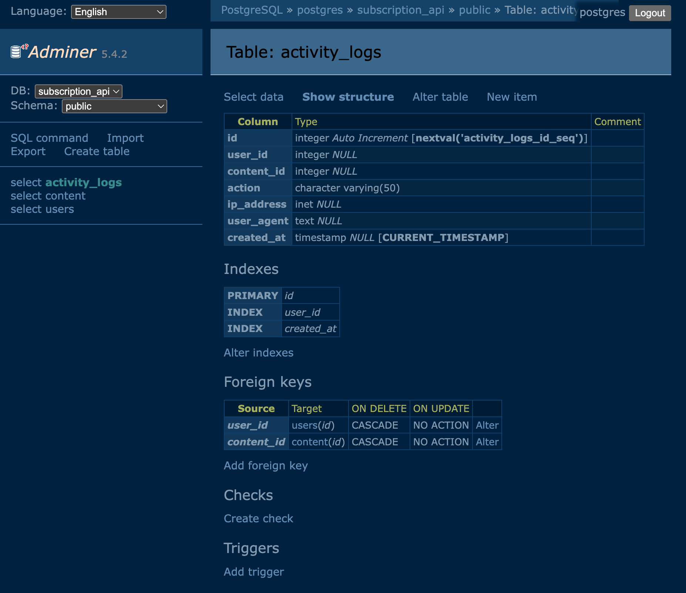
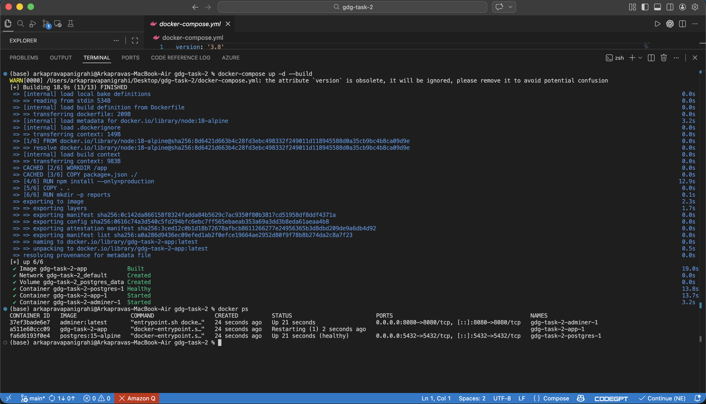

# Subscription-Based Content API

A comprehensive backend API for a premium content platform where users must have an active subscription to access protected content. The system enforces access control based on user subscription status and supports basic subscription management with advanced analytics and reporting capabilities.

## 🚀 **Complete Feature Set**

### **Core Features**
- **User Authentication**: JWT-based authentication with user registration and login
- **Role-Based Access Control**: Free and Premium user roles with automatic expiration handling
- **Protected Content**: Premium content accessible only to subscribers
- **Subscription Management**: Upgrade from Free to Premium with simulated payment processing
- **Activity Logging**: Comprehensive logging of all user activities and content access
- **Admin Dashboard**: Complete admin interface with statistics and user management

### **Advanced Features**
- **CSV Reporting System**: Generate monthly usage reports, user activity reports, and premium content analytics
- **Subscription Expiration**: Automatic role downgrade when subscription expires (30 days)
- **Docker Deployment**: Complete containerized setup with PostgreSQL and Adminer
- **Security Features**: Rate limiting, input validation, CORS protection, and security headers

## Implementation Screenshots

### User Authentication

#### Register User


#### Login User


---

### User APIs

#### Get Current User Profile


---

### Subscription APIs


#### Update Subscription



---

### Content APIs

#### Create Content


#### Fetch Content (Subscription Protected)



### Database Tables

#### Users Table


#### Content Table


#### Activity Logs


### docker deployment

#### running containers




## 🛠 **Technologies**

- **Backend**: Node.js with Express.js
- **Database**: PostgreSQL 15 with automatic schema initialization
- **Authentication**: JWT (JSON Web Tokens) with secure password hashing
- **Security**: Helmet, CORS, Rate Limiting, bcrypt
- **Validation**: Joi for comprehensive input validation
- **Reporting**: Custom CSV generation utility
- **Deployment**: Docker & Docker Compose
- **Development**: Nodemon for hot reloading

## 🚀 **Quick Start Options**

### **Option 1: Docker (Recommended)**
```bash
# Clone and navigate to the project
git clone <repository-url>
cd gdg-task-2

# Start all services (API + Database + Admin Panel)
docker-compose up -d

# Access the API
curl http://localhost:3000
```

**Services Available:**
- 🌐 **API Server**: http://localhost:3000
- 🗄️ **Database Admin**: http://localhost:8080 (Adminer)
- 🐘 **PostgreSQL**: localhost:5432

### **Option 2: Manual Setup**

#### Prerequisites
- Node.js (v14 or higher)
- PostgreSQL (v12 or higher)
- npm or yarn

#### Installation Steps

1. **Clone the repository**
   ```bash
   git clone <repository-url>
   cd gdg-task-2
   ```

2. **Install dependencies**
   ```bash
   npm install
   ```

3. **Set up environment variables**
   ```bash
   cp .env.example .env
   ```
   
   Edit `.env` file with your database credentials:
   ```env
   DB_HOST=localhost
   DB_PORT=5432
   DB_NAME=subscription_api
   DB_USER=your_username
   DB_PASSWORD=your_password
   JWT_SECRET=your_super_secret_jwt_key_here
   JWT_EXPIRES_IN=24h
   PORT=3000
   NODE_ENV=development
   ```

4. **Set up the database**
   ```bash
   # Create database
   createdb subscription_api
   
   # Run schema
   psql -d subscription_api -f database/schema.sql
   ```

5. **Start the server**
   ```bash
   # Development mode with auto-restart
   npm run dev
   
   # Production mode
   npm start
   ```

The server will start on `http://localhost:3000`

## 📚 **API Documentation**

### **Authentication Endpoints**

#### **Register New User**
```http
POST /auth/register
Content-Type: application/json

{
  "username": "john_doe",
  "email": "john@example.com",
  "password": "password123"
}
```

#### **User Login**
```http
POST /auth/login
Content-Type: application/json

{
  "email": "john@example.com",
  "password": "password123"
}
```

#### **Upgrade to Premium**
```http
POST /auth/upgrade
Authorization: Bearer <jwt_token>
```

### **Content Endpoints**

#### **Get All Content**
```http
GET /content
```

#### **Get Free Content Only**
```http
GET /content/free
```

#### **Get Premium Content** *(Premium Users Only)*
```http
GET /content/premium
Authorization: Bearer <jwt_token>
```

#### **Get Specific Content**
```http
GET /content/:id
Authorization: Bearer <jwt_token> *(required for premium content)*
```

#### **Create New Content** *(Authenticated Users)*
```http
POST /content
Authorization: Bearer <jwt_token>
Content-Type: application/json

{
  "title": "New Content Title",
  "body": "Content body text",
  "is_premium": true
}
```

### **Admin Endpoints** *(Admin Only)*

#### **Get All Activity Logs**
```http
GET /admin/logs
Authorization: Bearer <admin_jwt_token>
```

#### **Get Premium Access Logs**
```http
GET /admin/logs/premium
Authorization: Bearer <admin_jwt_token>
```

#### **Get Usage Statistics**
```http
GET /admin/stats
Authorization: Bearer <admin_jwt_token>
```

#### **Get All Users**
```http
GET /admin/users
Authorization: Bearer <admin_jwt_token>
```

### **📊 CSV Reporting Endpoints** *(Admin Only)*

#### **Generate Monthly Usage Report**
```http
GET /admin/reports/monthly/:year/:month
Authorization: Bearer <admin_jwt_token>
```

#### **Generate User Activity Report**
```http
GET /admin/reports/user/:userId/:year/:month
Authorization: Bearer <admin_jwt_token>
```

#### **Generate Premium Content Report**
```http
GET /admin/reports/premium-content/:year/:month
Authorization: Bearer <admin_jwt_token>
```

#### **Download Generated Report**
```http
GET /admin/reports/download/:filename
Authorization: Bearer <admin_jwt_token>
```

#### **List Available Reports**
```http
GET /admin/reports/available
Authorization: Bearer <admin_jwt_token>
```

## 💡 **Example API Usage**

### **1. Register a New User**
```bash
curl -X POST http://localhost:3000/auth/register \
  -H "Content-Type: application/json" \
  -d '{
    "username": "testuser",
    "email": "test@example.com",
    "password": "password123"
  }'
```

### **2. Login User**
```bash
curl -X POST http://localhost:3000/auth/login \
  -H "Content-Type: application/json" \
  -d '{
    "email": "test@example.com",
    "password": "password123"
  }'
```

### **3. Access Free Content**
```bash
curl http://localhost:3000/content/free
```

### **4. Try to Access Premium Content** *(Will Fail - Free User)*
```bash
curl http://localhost:3000/content/premium \
  -H "Authorization: Bearer <your_jwt_token>"
```

### **5. Upgrade to Premium**
```bash
curl -X POST http://localhost:3000/auth/upgrade \
  -H "Authorization: Bearer <your_jwt_token>"
```

### **6. Access Premium Content** *(After Upgrade)*
```bash
curl http://localhost:3000/content/premium \
  -H "Authorization: Bearer <your_new_jwt_token>"
```

### **7. Generate Monthly Report** *(Admin Only)*
```bash
curl http://localhost:3000/admin/reports/monthly/2024/3 \
  -H "Authorization: Bearer <admin_jwt_token>"
```

### **8. Download Generated Report** *(Admin Only)*
```bash
curl -O http://localhost:3000/admin/reports/download/usage_report_2024_03.csv \
  -H "Authorization: Bearer <admin_jwt_token>"
```

## 📋 **HTTP Status Codes**

| Status | Description | Usage |
|--------|-------------|-------|
| `200 OK` | Request successful | Data retrieval, successful operations |
| `201 Created` | Resource created | User registration, content creation |
| `400 Bad Request` | Invalid input data | Validation failures |
| `401 Unauthorized` | Authentication required | Missing/invalid token |
| `402 Payment Required` | Payment failed | Subscription upgrade failure |
| `403 Forbidden` | Premium subscription required | Accessing premium content as free user |
| `404 Not Found` | Resource not found | Invalid content ID, user not found |
| `409 Conflict` | User already exists | Duplicate registration |
| `500 Internal Server Error` | Server error | Database issues, unexpected errors |

## 🔐 **Security Features**

- **🔑 Password Hashing**: Using bcrypt for secure password storage
- **🎫 JWT Authentication**: Secure token-based authentication with expiration
- **🚦 Rate Limiting**: Prevents abuse with configurable request limits
- **✅ Input Validation**: Comprehensive Joi validation for all API inputs
- **🌐 CORS Protection**: Configurable cross-origin resource sharing
- **🛡️ Security Headers**: Helmet middleware for enhanced security
- **📊 Activity Logging**: Complete audit trail of all user actions

## 📊 **Activity Logging**

The system automatically logs:
- ✅ User registration and login attempts
- ✅ Premium content access with timestamps
- ✅ Subscription upgrades and payment processing
- ✅ Content creation and modifications
- ✅ IP addresses and user agents for analytics
- ✅ Failed authentication attempts

## 🎯 **Enhancements Implemented**

✅ **Subscription Expiration Logic**: Premium access expires after 30 days with automatic role downgrade  
✅ **Monthly Usage Reports in CSV Format**: Comprehensive reporting system with multiple report types  
✅ **Admin Endpoint**: Complete admin dashboard with analytics and user management  
✅ **Docker Setup for Local Deployment**: Production-ready containerized deployment

## 🐳 **Docker Deployment**

### **🚀 Quick Start with Docker Compose**

```bash
# Clone and navigate to the project
git clone <repository-url>
cd gdg-task-2

# Start all services (API + Database + Admin Panel)
docker-compose up -d

# View real-time logs
docker-compose logs -f

# Stop all services
docker-compose down
```

### **Available Services**

| Service | URL | Description |
|----------|-----|-------------|
| **API Server** | http://localhost:3000 | Main application API |
| **Database Admin** | http://localhost:8080 | Adminer (PostgreSQL admin) |
| **PostgreSQL** | localhost:5432 | Database server |

### **Docker Services Configuration**

The Docker Compose setup includes:

- **app**: Node.js API server with production optimizations
- **postgres**: PostgreSQL 15 with automatic schema initialization
- **adminer**: Web-based database administration tool
- **postgres_data**: Persistent volume for database storage

### **Environment Variables**

Default production configuration:
```yaml
DB_HOST=postgres
DB_PORT=5432
DB_NAME=subscription_api
DB_USER=postgres
DB_PASSWORD=password123
JWT_SECRET=your_super_secret_jwt_key_change_in_production
JWT_EXPIRES_IN=24h
PORT=3000
NODE_ENV=production
```

> **Security Warning**: Change `JWT_SECRET` and `DB_PASSWORD` in production!

### **Docker Commands Reference**

```bash
# Build and start all services
docker-compose up -d --build

# View running containers
docker-compose ps

# View application logs
docker-compose logs app

# View database logs
docker-compose logs postgres

# Access database shell directly
docker-compose exec postgres psql -U postgres -d subscription_api

# Restart specific service
docker-compose restart app

# Stop and remove with volumes
docker-compose down -v

# Force rebuild without cache
docker-compose build --no-cache
```

### **Production Deployment Guidelines**

For production deployment:

1. **Update Security**: Change all default passwords and secrets
2. **Enable SSL**: Configure HTTPS with proper certificates
3. **Backup Strategy**: Set up automated PostgreSQL backups
4. **Monitoring**: Configure logging and monitoring solutions
5. **Networking**: Configure proper network security groups
6. **Updates**: Set up automated security updates

### **Manual Docker Build**

If you prefer manual Docker deployment:

```bash
# Build the Docker image
docker build -t subscription-api .

# Run with external PostgreSQL
docker run -d \
  --name subscription-api \
  -p 3000:3000 \
  -e DB_HOST=your-postgres-host \
  -e DB_USER=your-db-user \
  -e DB_PASSWORD=your-db-password \
  -e DB_NAME=subscription_api \
  -e JWT_SECRET=your-jwt-secret \
  subscription-api
```

## **CSV Reports Feature**

### **Available Report Types**

1. **Monthly Usage Report**: Complete activity log for any month
   - **Endpoint**: `GET /admin/reports/monthly/:year/:month`
   - **Data**: User details, content accessed, timestamps, IP addresses
   - **Use Case**: Overall platform analytics

2. **User Activity Report**: Individual user activity tracking
   - **Endpoint**: `GET /admin/reports/user/:userId/:year/:month`
   - **Data**: Content accessed, actions taken, timestamps
   - **Use Case**: User behavior analysis

3. **Premium Content Report**: Premium content performance metrics
   - **Endpoint**: `GET /admin/reports/premium-content/:year/:month`
   - **Data**: Access counts, unique users, first/last access times
   - **Use Case**: Content performance analysis

### **Report Management**

| Action | Endpoint | Description |
|--------|----------|-------------|
| **List Reports** | `GET /admin/reports/available` | View all generated reports |
| **Download Report** | `GET /admin/reports/download/:filename` | Download CSV file |
| **Storage Location** | `/reports` directory | Local file storage |

### **Report Features**

- **Proper CSV Formatting**: Quoted fields with escaped characters
- **Automatic Directory Creation**: Reports directory created as needed
- **Comprehensive Data**: User details, content info, timestamps, IPs
- **Download Support**: Easy file access via API endpoints
- **Error Handling**: Invalid dates, missing data, file not found scenarios

### **Example Report Generation**

```bash
# Generate March 2024 monthly report
curl http://localhost:3000/admin/reports/monthly/2024/3 \
  -H "Authorization: Bearer <admin_token>"

# Generate user activity report for user ID 1
curl http://localhost:3000/admin/reports/user/1/2024/3 \
  -H "Authorization: Bearer <admin_token>"

# Download generated report
curl -O http://localhost:3000/admin/reports/download/usage_report_2024_03.csv \
  -H "Authorization: Bearer <admin_token>"
```

## **Project Structure**

```
gdg-task-2/
├── config/
│   └── database.js          # Database configuration
├── middleware/
│   ├── auth.js              # Authentication middleware
│   └── validation.js        # Input validation
├── models/
│   ├── User.js              # User model
│   ├── Content.js           # Content model
│   └── ActivityLog.js       # Activity logging model
├── routes/
│   ├── auth.js              # Authentication routes
│   ├── content.js           # Content routes
│   └── admin.js             # Admin routes
├── utils/
│   └── csvGenerator.js      # CSV report generation utility
├── database/
│   └── schema.sql           # Database schema
├── reports/                 # Generated CSV reports (created dynamically)
├── Dockerfile               # Docker container configuration
├── docker-compose.yml       # Docker Compose orchestration
├── .dockerignore            # Docker ignore file
├── server.js                # Main server file
├── package.json
├── .env.example
└── README.md
```

## **Development**

### **Running Tests**
```bash
npm test
```

### **Development Mode**
```bash
npm run dev  # Auto-restart on file changes
```

---

## **License**

**MIT License** - Feel free to use this project for personal or commercial purposes.

---


